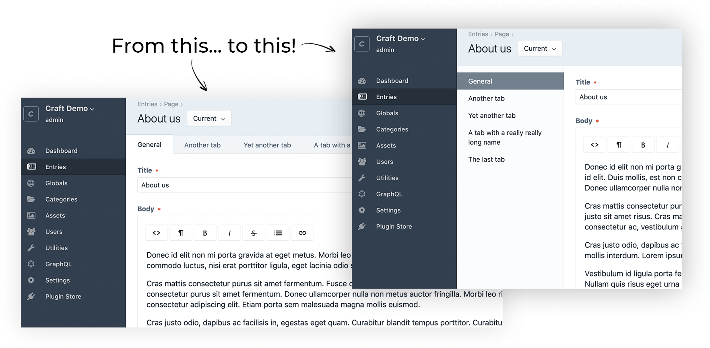
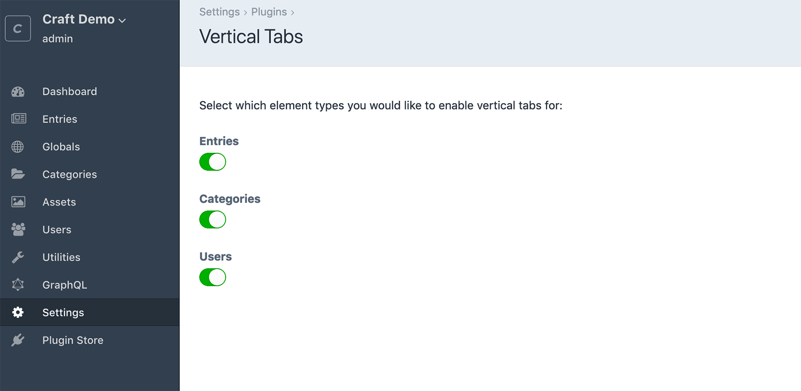

# Vertical Tabs plugin for Craft CMS 3.x

Replace the Craft CP's horizontal tabs with vertical tabs.

## Requirements

This plugin requires Craft CMS 3.0.0-beta.23 or later.

## Installation

To install the plugin, follow these instructions.

1. Open your terminal and go to your Craft project:

        cd /path/to/project

2. Then tell Composer to load the plugin:

        composer require peteheaney/craft-vertical-tabs

3. In the Control Panel, go to Settings → Plugins and click the “Install” button for Vertical Tabs.

---

## Overview

This plugin allows you to replace Craft's default horizontal tabs with vertical tabs on Entry, Category and User edit pages in the control panel.

---

## Configuration

Once the plugin is installed, it will be enabled for Entries, Categories and Users. If you'd like to disable it for certain Element types, go to Settings and, under Plugins, click on Vertical Tabs. You can then enable/disable Vertical Tabs as desired.

